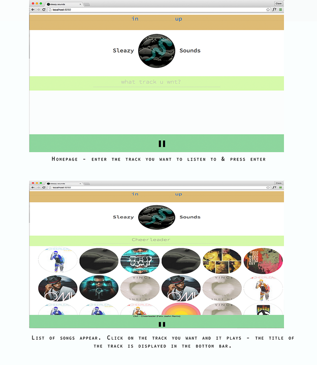

#Sleazy Sounds

See the [APP](http://sleazysounds.herokuapp.com/) 




**Sleazy Sounds** is a music website that lets users search for, and play tracks from Soundcloud. It allows subscribers to save their favourite tunes to playlists, which are limitted to their top 10 tracks of the moment. The playlists are then saved to the subscribers' private dashboard and displayed on the home page.

The project was set as a challenge for the 4-day 'Makerthon' at Makers Academy, and our team consisted of four music-loving ladies:
[Giorgia](https://github.com/giorgia-amici), [Mishal](https://github.com/mishal1), [Clare](https://github.com/ctrembath), and myself.

The site uses __Soundcloud's API__ to access one of the broadest and most current music libraries in the world.
To view the deployed app on Heroku, visit the following link [Sleazy Sounds](https://sleazysounds.herokuapp.com)

## Technologies used:

- Rails
- Ruby
- AngularJS
- Javascript
- jQuery
- HTML5
- CSS3
- Postgres 

## Testing frameworks:

- Rspec
- Capybara
- Karma
- Capybara-Webkit

## Future features we'd like to include:

- Ordering playlist featured on the home page according to most listened to and most recently added.
- Subscribers upload an image of their choice to represent their playlist.

## How to run tests:

```sh
$ git clone https://github.com/imarkwick/sleazy.git
$ cd sleazy
$ bundle
$ rspec
```

```sh
$ git clone https://github.com/imarkwick/sleazy.git
$ cd sleazy
$ bundle
$ karma start test/karma.conf
```

## How to run the server:

```sh
$ git clone https://github.com/imarkwick/sleazy.git
$ cd sleazy
$ bundle install
$ bin/rails s
```
